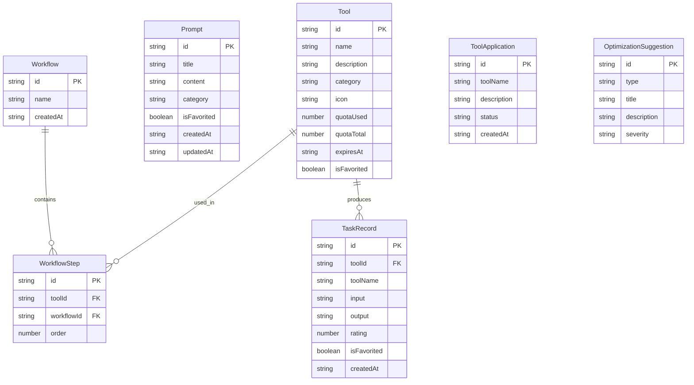

## 1. 架构设计

```mermaid
graph TB
    subgraph "前端层"
        "React App" --> "React Router"
        "React App" --> "Zustand Store"
        "React App" --> "Tailwind CSS"
    end
    subgraph "数据层"
        "Zustand Store" --> "LocalStorage 持久化"
        "Zustand Store" --> "Mock Data"
    end
```

纯前端架构，使用 Zustand 进行状态管理，LocalStorage 持久化数据，Mock 数据模拟后端服务。

## 2. 技术说明

- **前端**：React@18 + TypeScript + Tailwind CSS@3 + Vite
- **初始化工具**：vite-init
- **后端**：无（纯前端，使用 Mock 数据）
- **数据库**：LocalStorage 持久化 + 内存 Mock 数据
- **状态管理**：Zustand
- **路由**：React Router DOM v6
- **图标**：lucide-react
- **动画**：framer-motion

## 3. 路由定义

| 路由 | 用途 |
|------|------|
| / | 重定向到 /plaza |
| /plaza | 工具广场：浏览、搜索、收藏工具 |
| /workspace | 工作台：工具使用与流程编排 |
| /prompts | 提示词库：管理与搜索提示词模板 |
| /records | 任务记录：产出记录与评分 |
| /team | 团队空间：推荐清单与流程优化 |

## 4. API 定义

纯前端项目，不涉及后端 API。使用 Mock 数据层模拟数据操作：

```typescript
interface Tool {
  id: string
  name: string
  description: string
  category: ToolCategory
  icon: string
  quota: { used: number; total: number }
  expiresAt: string
  isFavorited: boolean
  suitableRoles: string[]
}

type ToolCategory = 'writing' | 'image' | 'translation' | 'research' | 'other'

interface Prompt {
  id: string
  title: string
  content: string
  category: string
  tags: string[]
  isFavorited: boolean
  variables: string[]
  createdAt: string
  updatedAt: string
}

interface Workflow {
  id: string
  name: string
  steps: WorkflowStep[]
  createdAt: string
}

interface WorkflowStep {
  id: string
  toolId: string
  order: number
  config: Record<string, string>
}

interface TaskRecord {
  id: string
  toolId: string
  toolName: string
  input: string
  output: string
  rating: number
  isFavorited: boolean
  createdAt: string
  workflowId?: string
}

interface ToolApplication {
  id: string
  toolName: string
  description: string
  reason: string
  applicant: string
  status: 'pending' | 'approved' | 'rejected'
  createdAt: string
}

interface OptimizationSuggestion {
  id: string
  type: 'duplicate' | 'inefficient' | 'outdated'
  title: string
  description: string
  severity: 'high' | 'medium' | 'low'
  relatedTools: string[]
}
```

## 5. 服务器架构图

不适用（纯前端项目）

## 6. 数据模型

### 6.1 数据模型定义



### 6.2 数据定义语言

使用 LocalStorage 存储，初始 Mock 数据在 `src/utils/mockData.ts` 中定义。
